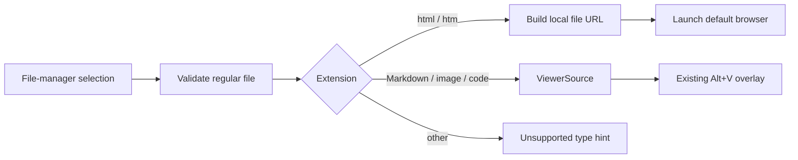

# HTML Viewer System Browser Design

## Problem

The Alt+V viewer supports Markdown, images, and source code inside a ratatui modal overlay. HTML needs support, but embedding a DOM/WebView renderer would add a browser engine lifecycle, native platform dependencies, focus and input routing, GPU/window integration, and a security boundary that do not fit the existing terminal-native snapshot viewer.

## Decision

Open `.html` and `.htm` files with the system default browser. HTML does not become a `ViewerKind`, does not produce a `ViewerPayload`, and does not enter `ViewerOverlayState`.

The same behavior applies to every viewer-open entry point:

- `Alt+V`
- bare `Right` on a regular file in the file manager
- the `viewer.open` command

The browser handoff is fire-and-forget. rimeterm keeps its current pane focus and does not create an empty viewer overlay.

## Alternatives Considered

### Embedded DOM/WebView renderer

Rejected. It provides full CSS and JavaScript behavior, but introduces heavyweight platform-specific runtime dependencies and a second window/input model. It also expands the attack surface for local HTML and remote subresources.

### Terminal HTML renderer

Rejected. Converting HTML to terminal text would be lightweight, but would provide a misleading partial result for CSS layout, JavaScript, forms, canvas, SVG, fonts, and browser security behavior. Maintaining another terminal layout engine is not justified when the default browser already provides the required semantics.

### System browser handoff

Accepted. It preserves standards-compliant HTML behavior, adds no rendering engine dependency, and keeps the existing viewer state machine unchanged.

## Architecture

Introduce an opening decision separate from terminal rendering classification:

```rust
enum ViewerOpenTarget {
    Overlay(ViewerSource),
    SystemBrowser(PathBuf),
}
```

The classification flow is:

1. Read metadata and require a regular file.
2. Match `.html` and `.htm` case-insensitively and return `SystemBrowser`.
3. Route Markdown, image, and code extensions through the existing `ViewerSource` classification and byte caps.
4. Preserve the existing unsupported-type behavior for every other extension.

`App::open_viewer_overlay` becomes the integration boundary:

- `Overlay(source)` follows the current deduplication, generation, worker, completion, and redraw path.
- `SystemBrowser(path)` launches the default browser and returns without calling `ViewerOverlayState::open_snapshot`.

No changes are required to `ViewerPayload`, `ViewerOverlayState`, Markdown/image/code loaders, rendering caches, scrolling, selection, or modal focus routing.



## Browser Handoff

Use `webbrowser` for the HTML-only handoff. The current generic `spawn_external` path follows the operating system's file association; an `.html` file can therefore open in an editor rather than a browser. Its Windows `cmd /C start` branch also crosses a command-shell parsing boundary. `webbrowser` resolves the configured browser explicitly, converts local paths to encoded `file://` URLs, suppresses GUI child output, and supports Windows, macOS, and Linux without embedding a browser engine.

Declare `webbrowser` with default features disabled; do not enable its `hardened` feature because this feature intentionally requires local `file://` URLs. Use `url::Url::from_file_path` at the rimeterm boundary so conversion errors and encoded-path behavior are testable before the handoff.

The handoff remains fire-and-forget. The generic `spawn_external` implementation stays responsible for `viewer.open-with-system` and `viewer.reveal`; HTML browser opening is a distinct operation because it promises a browser rather than an arbitrary registered application.

This design deliberately does not start a localhost HTTP server. A server would add port allocation, shutdown, directory exposure, path traversal, and origin-semantics concerns without being required for local HTML viewing.

## Interaction and State Invariants

- Opening HTML never changes `ViewerOverlayState::generation`.
- Opening HTML never changes the current overlay snapshot or focus.
- If another viewer overlay is already open, the global Alt+V toggle retains its current close behavior; HTML handoff only occurs when an open action is resolving a file selection.
- Existing `viewer.open-with-system` remains available for an already-open Markdown, image, or code snapshot.
- Browser launch success means only that the operating system accepted the handoff; page load success is outside rimeterm's process boundary.

## Error Handling

- Missing or unreadable path: preserve the current `viewer: <os error>` hint.
- Non-regular file: preserve `viewer: not a regular file`.
- Local-file URL conversion failure: show `viewer: cannot build browser URL: <reason>`.
- Browser process launch failure: show `viewer: open in browser failed: <reason>`.
- On every failure, keep focus and viewer overlay state unchanged.

HTML JavaScript, network requests, local subresources, CSP, CORS, and file-origin restrictions follow the selected browser's `file://` security policy. rimeterm neither relaxes nor emulates them.

## Verification

Unit and routing coverage should prove:

1. `.html`, `.HTML`, and `.htm` select the system-browser target.
2. Existing Markdown, image, and code extensions still select the overlay target.
3. Unsupported extensions still return the existing unsupported result.
4. HTML routing does not call `open_snapshot` and leaves generation and overlay status unchanged.
5. Paths containing spaces, non-ASCII characters, `#`, and `%` become valid local-file URLs.
6. Browser launch failures produce the browser-specific error hint.

Behavioral smoke check:

1. Select a local HTML file in the native file manager.
2. Press `Alt+V`.
3. Observe the default browser opening the file.
4. Confirm rimeterm creates no viewer overlay and retains the current pane focus.

## Scope

Expected implementation scope:

- `crates/rimeterm-tui/src/viewer.rs`: opening-target classification and focused tests.
- `crates/rimeterm-tui/src/app.rs`: route the browser target, keep the existing generic platform launch path, and add routing/error tests.
- `Cargo.toml`, `Cargo.lock`, and `crates/rimeterm-tui/Cargo.toml`: declare `url` and `webbrowser` directly; `url` is already present in the lockfile through `fast-resume`, while `webbrowser` is new.

No embedded browser, HTML parser, DOM renderer, local server, browser automation, or remote URL support is included.
