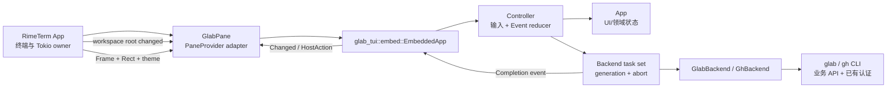

# RimeTerm 原生嵌入 glab-tui 设计

## 1. 目标

将 [`rcieri/glab-tui`](https://github.com/rcieri/glab-tui) fork 为 RimeTerm 的 in-tree workspace crate，通过 Rust API 原生嵌入；不把 `glab-tui` 可执行文件当成插件，不创建 PTY，不走终端转义桥接。

用户可在左上区域打开固定的 **Glab** Tab。它代表远端 Todo / 项目工作区：首次进入默认显示上游 `Todos`（GitHub 时为 Notifications）视图，同时保留 Issues、MR/PR、Pipeline/Action 等原生视图和操作。

非目标：

- 运行、打包或调用外部 `glab-tui` UI binary。
- 重写 GitLab/GitHub HTTP 客户端。
- 引入新的 binary 插件协议。
- 只移植 Todos 子集。
- 修改 RimeTerm 四区布局。

## 2. 约束与依据

1. RimeTerm 已将 yazi/gitui PTY pane 替换为原生 `FileManagerPane`/`GitPane`，并退役 Settings > Tools 与通用外部 UI 工具管理面。RimeTerm 内的 UI pane 必须原生。
2. `crates/tuxedo` 已建立直接先例：固定上游快照、完整 vendoring、增加 bounded `EmbeddedApp`，再由原生 `TodoPane` 适配 `PaneProvider`。
3. glab-tui 上游 v0.8.3 的 Cargo package 当前只有 binary target，但 UI、领域模型和 backend 都是普通 Rust 模块。缺少 `lib.rs` 是上游包结构事实，不要求使用 PTY。
4. 上游通过 `tokio::process::Command` 调用 `glab`/`gh` 完成 API 业务。这些命令不接管 RimeTerm 终端、不绘制 UI，属于允许的业务后端 CLI。`git` 同样只用于仓库探测。

相关历史：

- `c64ad69671a6`：native FileManagerPane/GitPane 替换外部 UI binaries。
- `0e664a2d4808`：发布 clean cutover，移除 UI binary bridge/runtime paths。
- `37193686cdd2`：退役 Settings > Tools。
- `c87093112085`：完整 fork Tuxedo 并增加原生嵌入 API。

## 3. Fork、快照与许可证

新增 workspace member：

- 路径：`crates/glab-tui`
- Cargo package：`glab-tui`
- Rust library crate：`glab_tui`
- 上游：`https://github.com/rcieri/glab-tui`
- 初始快照：`c11c244a43d9cc1c71952ab887d09c9bba9476f3`（v0.8.3，2026-08-04）

`crates/glab-tui/UPSTREAM.md` 记录 upstream URL、commit、导入日期、RimeTerm patch 列表和后续同步步骤。同步采用固定快照：对比上游 commit，导入完整源码与测试，再重放集中在 embedding 边界的补丁；不使用浮动 git dependency。

保留上游 `LICENSE.md` 原文：MIT，Copyright (c) 2026 rcieri。根 `ACKNOWLEDGEMENTS.md` 增加来源、commit、MIT 归属和 RimeTerm 修改说明。RimeTerm 自有适配代码继续使用仓库 Apache-2.0。

## 4. 方案比较

### 方案 A：单一完整 workspace crate + embed/controller 模块

完整保留上游 domain/backend/app/ui/cache/themes/tests，在同一 crate 新增 `lib.rs`、`controller.rs`、`embed.rs`；把 `main.rs` 中可复用的事件归约和输入处理移入 controller。RimeTerm 只依赖 `glab_tui::embed::EmbeddedApp`。

优点：与 Tuxedo 模式一致；一个 crate、一个依赖图；上游同步时文件对应清晰；不为不存在的第二消费者制造 crate 边界。缺点：上游 `main.rs` 体积大，首次拆分工作较多。

不保留 binary target。删除 `[[bin]]` 和 standalone 终端入口，避免 workspace 构建重新产出可被误用的 UI binary。

### 方案 B：core crate + optional standalone binary

拆成 `glab-tui-core` 与 standalone `glab-tui` binary。

优点：库与独立应用边界强。缺点：重排大量 module path、feature 和测试，持续制造上游同步冲突；RimeTerm 没有独立 binary 需求。当前属于过度设计。

### 方案 C：只 port Todos 子集

只复制 notification model/backend/table/render。

优点：初始代码少。缺点：丢失完整项目操作能力，重复 backend/auth/cache 逻辑，上游修复难以同步，后续需求会再次扩张。

**决策：采用方案 A。**

## 5. 总体架构



所有 `App` 状态只在 RimeTerm 主循环线程修改。后台任务只持有不可变请求快照并返回 typed completion；不得从任务直接修改 `App` 或绘制。`render` 不执行 I/O、不 drain channel。

## 6. 上游拆分边界

### 保留为库能力

- `app.rs`：Tab、table/list/overlay、过滤、详情、loading/error、diff state。
- `backend/{mod,glab,gh}.rs`、`domain/**`：业务 API 抽象、解析和 host-neutral model。
- `fetch.rs`：请求构造与 async task body，保留 typed completion event。
- `ui/**`：改造成 area-bounded render。
- cache、templates、themes、keybinding：消除全局状态后保留。

### 由宿主控制

- Tokio runtime 和任务生命周期。
- crossterm input、tick、resize 与 terminal 初始化/恢复。
- workspace root 与切换通知。
- pane `Rect`、焦点、可见性和全局快捷键优先级。
- RimeTerm theme 映射、F5 reload、状态持久化和错误提示。
- 外部编辑器、浏览器等宿主动作。

### 禁用或消除

- `event.rs` 的 crossterm poll/read task 和 process-global `PAUSED`。
- `main.rs` 的 raw mode、alternate screen、mouse capture、stdout terminal、`set_current_dir`、`process::exit` 和独立 event loop。
- `editor.rs` 直接切换 terminal mode 和启动交互式 editor 的实现。
- `config.rs` 的 process-global `THEME`/`ICONS`，以及 GitHub backend 的 process-global current-user cache。
- 隐式读取 process cwd；所有路径从实例 `workspace_root` 派生。
- 独立 repo switcher 改变全进程 cwd。
- `glab-tui` UI binary target。

## 7. EmbeddedApp API

```rust
pub struct EmbeddedOptions {
    pub workspace_root: PathBuf,
    pub initial_tab: Tab,
    pub cache_policy: CachePolicy,
    pub refresh: RefreshPolicy,
    pub features: EmbeddedFeatures,
}

pub struct EmbeddedFeatures {
    pub mutations: bool,
    pub external_editor: bool,
    pub open_browser: bool,
    pub repo_switcher: bool,
    pub save_upstream_config: bool,
}

pub struct EmbeddedApp { /* App + Controller + receiver + task set */ }

pub enum EmbeddedOutcome {
    Unchanged,
    Changed,
    ExitRequested,
    HostAction(HostAction),
}

pub enum HostAction {
    EditText {
        request_id: u64,
        title: String,
        body: String,
        suffix: String,
    },
    OpenUrl(String),
}

impl EmbeddedApp {
    pub fn new(options: EmbeddedOptions, runtime: tokio::runtime::Handle) -> Self;
    pub fn handle_key(&mut self, key: KeyEvent) -> EmbeddedOutcome;
    pub fn handle_mouse(&mut self, event: MouseEvent, area: Rect) -> EmbeddedOutcome;
    pub fn render(&mut self, frame: &mut Frame<'_>, area: Rect, theme: &EmbeddedTheme);
    pub fn poll_background(&mut self, now: Instant) -> EmbeddedOutcome;
    pub fn next_deadline(&self) -> Option<Instant>;
    pub fn set_visible(&mut self, visible: bool) -> EmbeddedOutcome;
    pub fn set_workspace_root(&mut self, root: PathBuf) -> Result<EmbeddedOutcome>;
    pub fn reload(&mut self) -> EmbeddedOutcome;
    pub fn snapshot(&self) -> EmbeddedState;
    pub fn restore(&mut self, state: &EmbeddedState);
    pub fn complete_host_action(&mut self, id: u64, result: HostActionResult);
    pub fn shutdown(&mut self);
}
```

`new` 同步返回 Loading 状态并使用宿主 runtime handle 启动检测任务，避免构造 pane 时阻塞。`Drop`/`shutdown` abort 所有任务。每次 workspace 切换增加 generation；completion 携带 generation，旧结果必须丢弃。

不向 RimeTerm 公开 `app_mut()`。宿主通过窄 API 集成，测试通过只读 inspection 或 observable render/state 验证。

## 8. GlabPane 与左上 Tab

新增 `crates/rimeterm-tui/src/glab_pane.rs`：

- `GlabPane { id, root, state: Loading | Ready(EmbeddedApp) | Error, visible, next_poll }`
- `PaneProvider::title()` 固定返回 `"glab"`；catalog label 为 `"Glab"`。
- `render` 仅调用 `EmbeddedApp::render(frame, area, mapped_theme)`。
- `on_key`/`on_mouse` 转交 EmbeddedApp。
- `ExitRequested` 激活 Files；`HostAction` 进入 RimeTerm 宿主流程。
- `poll_background` drain completion、处理刷新 deadline，并返回 dirty。
- `set_visible` 控制周期刷新：隐藏时不启动新网络刷新，但继续 drain 已完成任务。
- `reload` 强制刷新当前 project/tab。

左上 canonical catalog 顺序：

1. `files` / Files
2. `todo` / Todo
3. `glab` / Glab
4. `fr` / Fast Resume

`LeftTabsState::normalize` 自动把 `glab` 插入旧配置。Glab pane 加入 `pinned_pane_ids`，不能关闭，但可按现有 Settings > Tabs 规则隐藏和重排；Files 仍是强制锚点。

## 9. 输入、鼠标与渲染

RimeTerm 继续读取唯一 crossterm event stream。全局菜单、tab strip、divider 和焦点规则先处理；命中 Glab 内容区域后再调用 `on_key`/`on_mouse`。

将上游全画布 render 改为 `ui::draw_in(frame, area, app, theme)`：背景、最小尺寸保护和 layout 都以 `area` 为根，绝不清空或覆盖其他 pane。最小尺寸不足时只在 Glab pane 内显示紧凑提示。

主题和 icons 是 `EmbeddedTheme`/`EmbeddedIcons` 实例字段；RimeTerm semantic palette 负责映射。上游缓存的 sidebar/content/detail/overlay rect 使用宿主实际绝对坐标。

周期刷新通过 `next_deadline` 和 pane visibility 调度，不自行生成 crossterm Tick。

## 10. Tokio、backend 与认证

业务请求在宿主 runtime 上执行。每个任务保存 `{ generation, request_id, project_context, root, backend_kind }`；命令使用参数数组并显式 `.current_dir(root)`，禁止 shell 拼接和全进程 `set_current_dir`。同一类型只允许一个 in-flight refresh；workspace 切换 abort 旧任务并清空临时状态。

允许的外部业务命令：

- `glab`：GitLab API 和 mutation backend。
- `gh`：GitHub API 和 mutation backend。
- `git`：读取 origin、branch 和 repository metadata。

不允许的外部 UI 命令：

- `glab-tui`。
- 任何负责绘制 pane 的 TUI binary。
- 默认外部 editor。

浏览器和 editor 只能作为 `HostAction` 交给 RimeTerm；初始 editor feature 关闭。

认证沿用 `glab auth login` / `gh auth login` 已有配置和环境。RimeTerm 不读取、复制、缓存或记录 token，也不自动发起 login。缺少 CLI 或未认证时，pane 保留 offline cache 并显示可操作错误。命令日志不得记录 token、请求 body 或 credential-bearing URL。

## 11. Workspace root 更新

文件管理器 cwd 变化和 `workspace.cwd.set` 必须走同一个宿主 helper，同时通知 GitPane 与 GlabPane；不能只修改 status label。

切换流程：

1. 宿主解析新 `active_root`。
2. GlabPane generation +1，abort 旧任务，清空临时 overlay/input/loading。
3. 用新 root 的 git metadata 检测 GitLab/GitHub 和 project path。
4. 载入 project-keyed offline cache，立即绘制缓存。
5. 创建实例级 backend，复用 CLI 已有认证。
6. 后台刷新当前内部 Tab和 repo attributes。
7. completion 回主线程归约、保存 cache、请求 redraw；旧 generation completion 丢弃。

任何路径都不得调用 `std::env::set_current_dir`。

## 12. 状态、缓存与错误

在 RimeTerm memory state 增加 Glab pane 的稳定状态。保存：

- 内部 active tab。
- 各 tab cursor。
- search query。
- detail visibility/scroll。
- column/filter/group/sort。
- 最后 backend kind/project，仅作展示提示。

不保存 overlay、loading、error、in-flight request 或认证信息。

remote data cache 保留 project-keyed 语义，路径由显式 root/project 计算，写入使用临时文件 + rename。UI memory 与 remote data cache 分开。

读取失败显示错误且不覆盖当前内存；网络失败时若已有 cache，显示 Offline 状态并继续可读；无 cache 才进入 Error/Empty。错误不得使 RimeTerm 退出。

## 13. 测试与验收

### Fork crate 单元测试

- `draw_in` 只修改指定 `Rect`，区域外 buffer 不变；小区域不 panic。
- key/mouse 对 active table、sidebar、overlay、scroll 的可观察状态变更。
- Event reducer 对成功、失败、offline fallback 和 mutation completion 的状态归约。
- generation 过滤：切 root 后旧 completion 不污染新项目。
- `set_workspace_root` 不改变 process cwd，所有 Command 收到显式 cwd。
- hidden pane 不启动周期刷新，但仍 drain completion；visible 恢复时到期刷新一次。
- snapshot/restore 稳定字段 round-trip，不含 secret/transient state。
- fake command runner 验证 argv、cwd、stdout/stderr、缺失 CLI 和 auth failure。
- GitLab/GitHub 双 backend 的 Todos/Notifications 与 project context。

### RimeTerm 集成测试

- fresh catalog 顺序 `Files, Todo, Glab, Fast Resume`。
- 旧 `LeftTabsState` normalize 后插入 `glab`。
- Glab 固定、可隐藏、可恢复 active tab；ExitRequested 激活 Files。
- 文件管理器导航和 `workspace.cwd.set` 均通知 GitPane 与 GlabPane。
- pane background dirty 触发 redraw；F5 刷新当前 Glab project。
- theme 映射、鼠标坐标、tab strip/divider 优先级。
- memory policy 和 PaneState 持久化。

### 端到端 smoke

使用临时 GitLab/GitHub fixture repo 和 PATH 中 fake `git`/`glab`/`gh`：启动 RimeTerm，切到 Glab，观察缓存首帧、Todos completion、切 workspace 后内容更新、失败后离线回退。

必须验证：

- 进程树中没有 `glab-tui`。
- 没有为 Glab pane 创建 PTY session。
- 只在业务刷新时出现短生命周期 `git`/`glab`/`gh`。

## 14. 风险与缓解

- **上游 main 耦合重**：先机械移动 mouse/key/event reducer 到 controller，保持 typed Event 和既有测试，再收紧 API；不同时重写领域逻辑。
- **全局状态串项目**：实例化 theme/icons/current-user cache；completion 加 generation；所有命令显式 cwd。
- **后台任务泄漏或旧数据回写**：保存 AbortHandle，root change/Drop 时 abort；归约时再次校验 generation。
- **CLI 版本与认证差异**：探测 executable/version/auth，保留脱敏 stderr 摘要和 offline cache；不自动安装或登录。
- **窄 pane 可用性**：使用 area-based breakpoints，窄屏隐藏 detail/sidebar，并针对 RimeTerm 实际左上尺寸做 snapshot/smoke。
- **上游同步冲突**：将差异集中在 `lib.rs`、`embed.rs`、`controller.rs`、theme adapter 和少数 cwd 注入点，并在 `UPSTREAM.md` 记录。
- **写操作误用项目上下文**：保留确认 overlay；mutation 发起和完成时双重校验 generation 与 project context。

## 15. 最终决策

采用单一完整 fork crate：`crates/glab-tui`。固定上游 v0.8.3 commit，新增 bounded native embedding API，不保留 binary target。

`GlabPane` 作为原生 `PaneProvider` 放在左上 catalog 第三项，默认打开上游 Todos/Notifications，保留完整远端项目视图。

`glab`/`gh`/`git` 仅作为无 UI 的业务后端命令。RimeTerm 独占终端、事件循环、渲染区域、Tokio 生命周期和 workspace root。